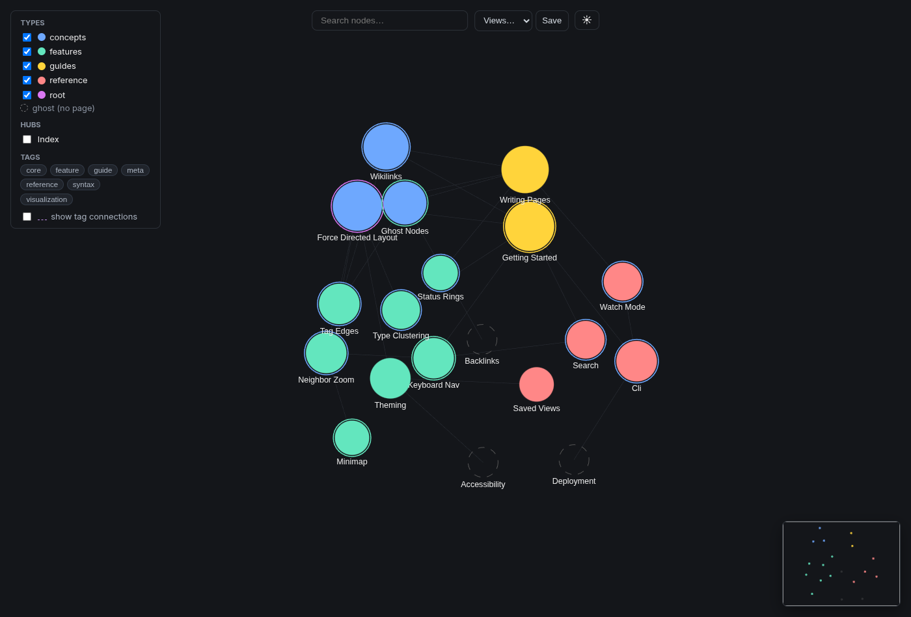
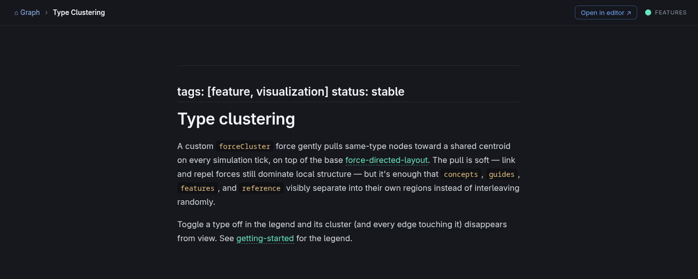

# wikilink-graph

A standalone, generic **force-directed graph viewer** for any `[[slug]]`-linked markdown wiki — a
self-contained take on the graph view familiar from Obsidian / Roam / Logseq. It parses a wiki
folder into a node/edge graph, renders it with a force-directed layout, and lets you click a node to
read its rendered markdown in-app — so you can graph a `[[wikilink]]` folder without needing one of
those apps, while staying reusable for any wiki folder.

Built with **Vite + React + `react-force-graph-2d` + `react-markdown`**. Default port **5179**. The
architecture reference is [`CLAUDE.md`](./CLAUDE.md).

Zero-config, `npm run dev`/`build` and the CLI both show the sample wiki in
[`examples/demo-wiki/`](./examples/demo-wiki) — enough pages to exercise every feature on a fresh
clone. Point `WIKI_DIR` (or the CLI `--wiki` flag) at any other folder to graph your own wiki instead:

```bash
node bin/wikilink-graph.mjs start --wiki examples/demo-wiki
```


*The force-directed graph view — dark theme, demo wiki loaded.*


*Click a node to read its page in-app.*

## Quick start (CLI — recommended)

`bin/wikilink-graph.mjs` (exposed as the `wikilink-graph` bin) is the easy way to run it. The wiki path is a
**required** argument on `start`; it serves in the background and tracks the process so `stop`
cleanly frees the port.

```bash
node bin/wikilink-graph.mjs start --wiki examples/demo-wiki      # parse + serve (live) in background
node bin/wikilink-graph.mjs status                               # running? where? which wiki?
node bin/wikilink-graph.mjs stop                                 # kill + free the port
```

`start` options:

| Flag | Default | Meaning |
|---|---|---|
| `-w, --wiki <path>` | *(required)* | Source wiki folder (resolved against CWD) |
| `-p, --port <n>` | `5179` | Vite serve port |
| `-e, --exclude <slugs>` | `INDEX,synthesis` | Slugs hidden by default (togglable in the UI) |
| `--build` | off | Build a self-contained `dist/` and serve that (`vite preview`) instead of live dev |
| `--watch` | off | Dev mode only: re-parse + full-reload whenever a `.md` file under `--wiki` changes (ignored with `--build`) |

It auto-runs `npm install` on first use, refuses to double-start, and writes logs to
`.wikilink-graph.log` (pid in `.wikilink-graph.pid`).

## Raw npm scripts (lower level)

```bash
npm run dev       # parse + Vite dev server (live).  Set the wiki with WIKI_DIR=… npm run dev
npm run build     # parse + production build into a self-contained dist/
npm run preview   # serve the dist/ build
npm run parse     # just regenerate public/graph.json + public/wiki/
npm run stop      # alias for `wikilink-graph stop`
```

## Configuration (env vars)

| Var | Default | Meaning |
|---|---|---|
| `WIKI_DIR` | `examples/demo-wiki` | Source wiki folder |
| `WIKI_EXCLUDE` | `INDEX,synthesis` | Slugs hidden by default (togglable) |
| `PORT` | `5179` | Vite serve port |
| `WIKI_WATCH` | unset | `1` enables `--watch`'s re-parse + full-reload behavior (dev mode only) |

## How it works

1. **Parser** (`scripts/parse-wiki.mjs`) walks `WIKI_DIR` and emits one node per `.md` file
   (`{ id: slug, label, type, file, ghost, degree, excluded, tags }`); `type` is the top-level
   subfolder. Edges come from `[[slug]]` wiki-links **and** relative `[](file.md)` links —
   undirected, deduped, mutual links collapsed. Links to non-existent pages become **ghost** nodes
   (dashed in the UI). The parser also copies the wiki's `.md` files into `public/wiki/` so the
   reader can fetch raw markdown, and records the absolute source dir for the "Open in editor" link.
   Output: `public/graph.json` (`{ meta, nodes, links }`).
2. **Front end** (`src/`): `App.tsx` loads `graph.json` and owns routing/filter state;
   `components/Graph.tsx` renders the `ForceGraph2D` (color by type, radius by degree, hover/select
   highlights neighbors); `components/PageView.tsx` is a full-page reader overlay (renders markdown,
   rewrites `[[slug]]` into in-app links, "Open in editor" → `vscode://`); `Toolbar.tsx` (search +
   saved views) and `Filters.tsx` (type toggles, hub toggles, tag cloud). Routing is hash-based
   (`#/page/<slug>`), so reader URLs are shareable deep links.

## Notes

- Generated artifacts (`public/graph.json`, `public/wiki/`, `dist/`, `.wikilink-graph.pid`,
  `.wikilink-graph.log`) are gitignored and regenerable.
- Saved views are stored in `localStorage` (`wikilink-graph.views`).

## License

[MIT](./LICENSE) — © 2026 Deepak Tuteja. Free to use, modify, and redistribute.

Built on the open-source [`react-force-graph-2d`](https://github.com/vasturiano/react-force-graph)
and [`react-markdown`](https://github.com/remarkjs/react-markdown) (both MIT).

> **Not affiliated with, endorsed by, or sponsored by Obsidian (Dynalink Technologies), Roam, or
> Logseq.** Those names are used only nominatively, to describe the kind of graph-view experience
> this tool offers. wikilink-graph is an independent implementation built on the open-source libraries
> above; it contains no code or assets from any of those products.
